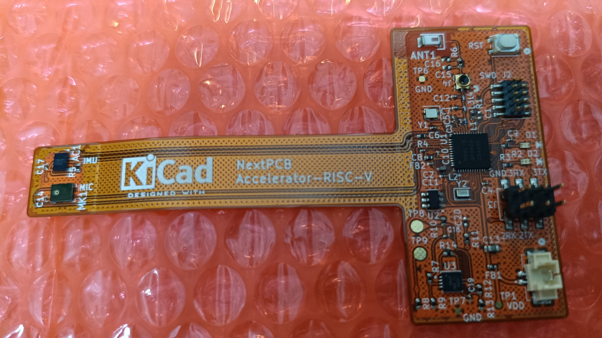
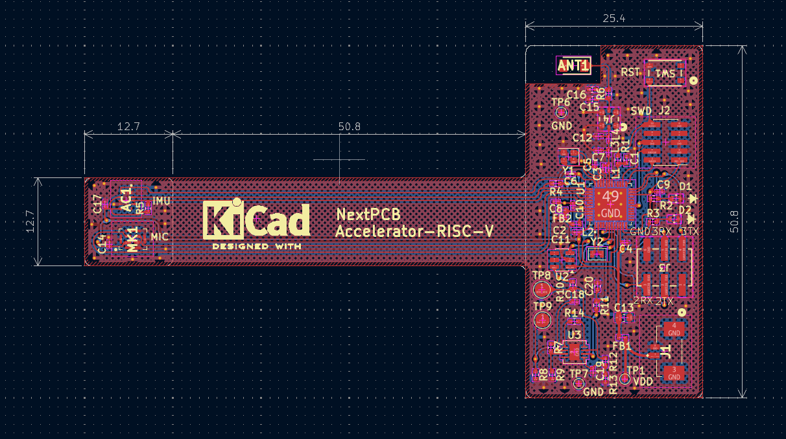

# Ghost Edge AI Sticker

This repository contains various firmware projects and hardware design files for the **Ghost Edge AI Sticker**, a custom sensor node board built around the **nRF54L15 SoC** and designed to run real-time Edge AI models using the **nRF Connect SDK (NCS)** / **Zephyr RTOS**. 

It includes single-core BLE samples, multi-core applications using IPC between the Host (ARM Cortex-M33) and Remote (RISC-V FLPR) cores, and Edge AI projects using Edge Impulse.

All firmware projects are located inside the `src/` directory, and the hardware design files are located inside the `board/` directory.

🎥 **[Watch the Demo Video on YouTube](https://youtu.be/orQzxtM1jN4)**

---

## 🛠️ Hardware Overview (Custom Board)

The **Ghost Edge AI Sticker** is designed as a ultra-thin, flexible sensor sticker utilizing a **Flexible Printed Circuit (FPC) board**. This FPC structure allows the sensor node to be bent and attached directly to various surfaces for unobtrusive physical activity and environment monitoring.

Below is the physical FPC custom board and its KiCad layout design:

| Physical FPC Custom Board (Top) | KiCad PCB Layout Design |
| :---: | :---: |
|  |  |

### `board/` Directory Structure

The `board/` directory contains all files required to view, modify, or manufacture the Ghost Edge AI Sticker:

* **[board/kicad/](./board/kicad/)**: KiCad project files (schematic and PCB layout).
* **[board/schematic/](./board/schematic/)**: PDF schematic drawings.
* **[board/gerber/](./board/gerber/)**: Gerber files for PCB manufacturing.
* **[board/bom/](./board/bom/)**: Bill of Materials (BOM) files detailing components to be mounted.
* **[board/img/](./board/img/)**: Hardware photos and layout designs.
  * `kicad_pcb_layout.png` - PCB Layout diagram in KiCad.
  * `physical_board_top.jpg` - Component-mounted FPC board (Top side).
  * `physical_board_bottom.jpg` - Component-mounted FPC board (Bottom side).
  * `bare_pcb_top.jpg` - Unpopulated bare PCB (Top side).
  * `fpc_panel_sheet.jpg` - Manufactured FPC panels on a sheet.

---

## Project List

Here is an overview of the projects available in this repository:

| Project Folder | Core(s) | Description |
| :--- | :--- | :--- |
| [blinky](./src/blinky/README.md) | Single (ARM) | Dual LED alternating blinky (LED0/LED1) toggling every 1 second. |
| [dfu_test](./src/dfu_test/README.md) | Single (ARM) | Bluetooth Peripheral UART with MCUboot and OTA DFU support. |
| [peripheral_lbs](./src/peripheral_lbs/README.md) | Single (ARM) | BLE Peripheral LED Button Service (LBS) to toggle LEDs and monitor button state. |
| [peripheral_uart_i2c](./src/peripheral_uart_i2c/README.md) | Single (ARM) | Streams raw LSM6DSO accelerometer data via I2C at 104Hz, packed and sent over BLE (NUS). |
| [peripheral_uart_i2c_demo](./src/peripheral_uart_i2c_demo/README.md) | Single (ARM) | Demo version of `peripheral_uart_i2c` that limits BLE transmission rate to 1Hz. |
| [peripheral_uart_i2c_edge](./src/peripheral_uart_i2c_edge/README.md) | Single (ARM) | Performs real-time Edge AI gesture inference on LSM6DSO data using Edge Impulse, streaming results over BLE. |
| [peripheral_uart_pdm](./src/peripheral_uart_pdm/README.md) | Single (ARM) | Runs real-time Edge AI audio inference using a PDM Microphone (*Note: Unconfirmed/Pin Conflict exists*). |
| [riscv_gpio](./src/riscv_gpio/README.md) | Dual (ARM+RISC-V) | RISC-V core controls alternating LEDs and sends status updates to ARM core via IPC (icmsg), which forwards them over BLE. |
| [riscv_uart](./src/riscv_uart/README.md) | Dual (ARM+RISC-V) | RISC-V core reads LSM6DSO accelerometer data via I2C and sends it to ARM core via IPC, which forwards it over BLE. |

---

## ⚖️ License

This repository is distributed under a **mixed licensing scheme (multi-license)**:

1. **Hardware & Original Work**: All hardware design files, schematics, and FPC layout projects in the `board/` directory are licensed under the **Apache License 2.0**.
2. **Firmware & SDK Derived Code**: Most firmware files in the `src/` directory (derived from the nRF Connect SDK) are subject to the **Nordic 5-Clause License**, which limits execution and use strictly to Nordic Semiconductor integrated circuits.

For more details and the full text of both licenses, please refer to the **[LICENSE](./LICENSE)** file.
